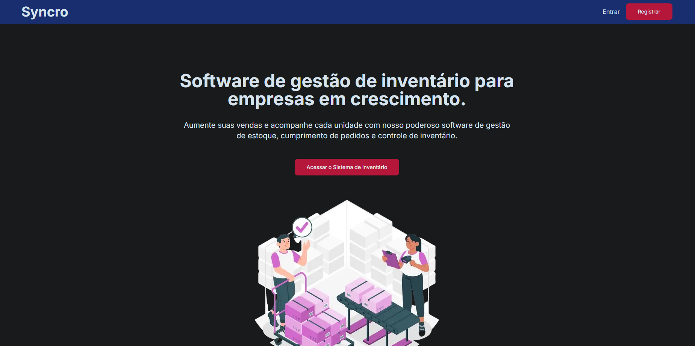

<h1 align="center">⚡ Syncro</h1>

<p align="center">
  
</p>

<p align="center">
  
  
  
  
  
  
  
</p>

<p align="center">
  <a href="https://syncro-pearl.vercel.app" target="_blank">
    🔗 <b>Ver projeto ao vivo</b>
  </a>
</p>

---

## 🧭 Sobre o projeto

O **Syncro** é um **software de gestão de inventário** desenvolvido como **projeto final do curso “Desenvolvedor Fullstack”** realizado pelo **SENAI** em parceria com a **Energisa**, dentro do programa **Rio Pomba Valley (MG)**.

A aplicação tem como objetivo **otimizar o controle de estoque, pedidos e inventário**, oferecendo uma interface moderna e intuitiva.  
Desenvolvido com **Next.js + React**, **Prisma ORM** e **MongoDB Cloud (Atlas)**, o projeto reflete o aprendizado técnico e prático adquirido ao longo da formação.

---

## 🎯 Objetivo

- Aplicar na prática os conhecimentos adquiridos durante o curso.  
- Construir uma aplicação **modular, responsiva e escalável**.  
- Demonstrar boas práticas de **arquitetura e design de software**.  
- Criar uma solução funcional de **gestão de inventário e pedidos**.

---

## ⚙️ Tecnologias Utilizadas

| Camada | Tecnologias |
|--------|--------------|
| **Frontend** | [Next.js (App Router)](https://nextjs.org/), [React](https://react.dev/), [Tailwind CSS](https://tailwindcss.com/) |
| **Backend** | [Node.js](https://nodejs.org/), [Prisma ORM](https://www.prisma.io/) |
| **Banco de Dados** | [MongoDB Atlas (Cloud)](https://www.mongodb.com/atlas) |
| **Infra & Deploy** | [Vercel](https://vercel.com/) |
| **Outros** | ESLint, PostCSS, TypeScript, Git/GitHub |

---

## 🧩 Estrutura do Projeto

```

syncro/
├── app/                 # Páginas e rotas (App Router)
├── components/          # Componentes reutilizáveis
├── context/             # Contextos globais e providers
├── lib/                 # Funções auxiliares e conexão Prisma
├── prisma/              # Schema Prisma configurado para MongoDB
├── public/              # Arquivos estáticos (preview.png, ícones, etc)
├── styles/              # Estilos globais
├── tailwind.config.js   # Configuração do Tailwind CSS
├── postcss.config.js
├── next.config.js
└── package.json

````

---

## 🚀 Como Executar Localmente

### 🧰 Pré-requisitos
- [Node.js 18+](https://nodejs.org/)
- npm, yarn ou pnpm
- Conta no [MongoDB Atlas (Cloud)](https://www.mongodb.com/atlas) com cluster criado

### ⚡ Passos

```bash
# 1️⃣ Clonar o repositório
git clone https://github.com/erickdevz/syncro.git
cd syncro

# 2️⃣ Instalar dependências
npm install

# 3️⃣ Configurar variáveis de ambiente (.env)
DATABASE_URL="mongodb+srv://<seu_usuario>:<sua_senha>@<seu_cluster>.mongodb.net/<seu_banco>"

# 4️⃣ Gerar o Prisma Client e rodar o projeto
npx prisma generate
npm run dev
````

Acesse: 👉 **[http://localhost:3000](http://localhost:3000)**

---

## 💻 Funcionalidades Principais

✅ Painel principal com acesso rápido ao sistema de inventário
✅ Controle de produtos e pedidos com banco de dados em nuvem
✅ Interface moderna e responsiva com **Tailwind CSS**
✅ Conexão com **MongoDB Cloud (Atlas)** via **Prisma ORM**
✅ Deploy automatizado na **Vercel**
✅ Código seguindo padrões de **Clean Code**

---

## 📈 Aprendizados

* Integração completa entre **frontend e backend**
* Modelagem de dados com **MongoDB + Prisma ORM**
* Criação e consumo de APIs RESTful
* Uso de **hooks e contextos globais**
* Versionamento com **Git** e **deploy automatizado na Vercel**

> O projeto demonstra a evolução técnica adquirida ao longo do curso, refletindo boas práticas de desenvolvimento Fullstack moderno.

---

## 🏫 Programa e Parcerias

| Entidade             | Descrição                                                      |
| -------------------- | -------------------------------------------------------------- |
| **SENAI MG**         | Formação técnica e acompanhamento do projeto final.            |
| **Energisa**         | Empresa parceira do programa, fomentando inovação tecnológica. |
| **Rio Pomba Valley** | Ecossistema de tecnologia e inovação de Minas Gerais.          |

---

## 🧾 Licença

Este projeto está licenciado sob os termos da **MIT License**.
Consulte o arquivo [LICENSE](./LICENSE) para mais informações.

---

## 👨‍💻 Autor

**Erick Xavier**
Desenvolvedor Back-End Java • Fullstack em formação
📍 Viçosa – MG
🔗 [LinkedIn](https://linkedin.com/in/erickxavierdev)
💻 [GitHub](https://github.com/erickdevz)
📫 [erickxavier.dev@gmail.com](mailto:erickxavier.dev@gmail.com)

---

<p align="center">
  <i>“A tecnologia é a ponte entre a ideia e o impacto. O Syncro representa essa travessia no meu aprendizado como desenvolvedor.”</i>
</p>
